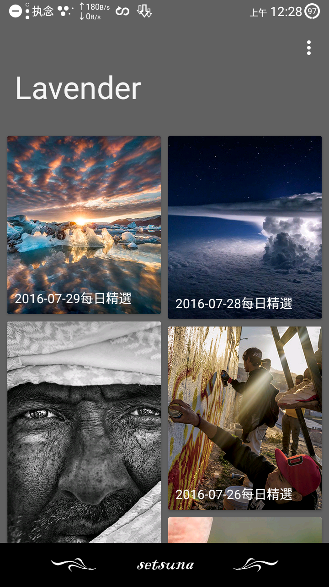
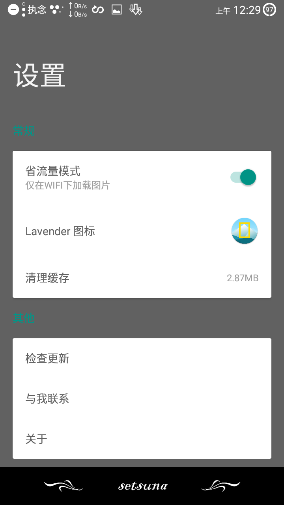
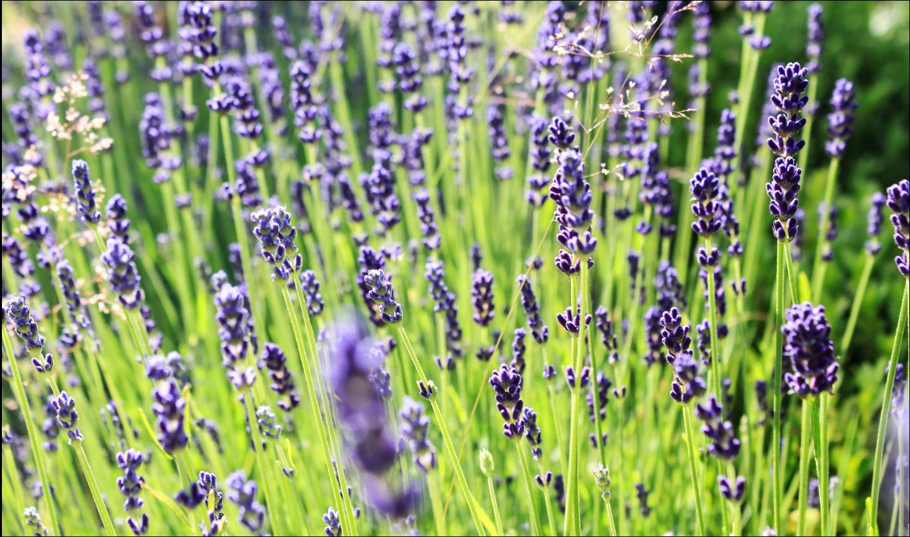

# Lavender
第三方国家地理每日精选Android客户端。

Download
-----------------
[![Lavender]](http://fir.im/Lavender116beta)  
[Lavender]:http://firicon.fir.im/4e6ac9a108c5adb3e9db6edbfd57577e44d2c67a?t=1468848643.5803108 "Lavender"

##ScreenShot
      

Discription:
-----------------
**图片来源**  
http://ng.bdatu.com/  
里面的图片拍摄的都还可以，每天推送十张左右，但是大部分图都有水印，没办法，接口里的图片就那样>o<。流量党慎用，图片没缩略图，平均分辨率在1000×666左右。

Change log
----------
* 增加动态选择图标功能
* 图片描述长按复制
* 采用RxPermission和RxBinding优化代码
* 去除5.0以下布局

TODO
----
* 选择图标后launcher刷新几秒才能加载新的，尝试做成立即刷新
* 转屏失效（未找到bug所在）
* 白色背景（手机上状态栏暗色背景设置无效）

Thanks
-----------------
感谢国家地理  
感谢默默付出的开源者  
感谢酷友 [@柠冰羽痕Ice](http://www.coolapk.com/u/482620) [@WangMT](http://www.coolapk.com/u/413199)所设计的两个图标

About Me
--------
[![facebook]](https://www.facebook.com/profile.php?id=100008406013865)  
[facebook]:https://www.facebook.com/rsrc.php/yl/r/H3nktOa7ZMg.ico "facebook"
[![twitter]](https://twitter.com/ComtinueD)  
[twitter]:https://abs.twimg.com/favicons/favicon.ico "twitter"
[![wordpress]](http://danyang.party/wordpress/)  
[wordpress]:https://s.w.org/favicon.ico?2 "wordpress"
[![google]](https://plus.google.com/u/0/101425594566289316258/posts)  
[google]:https://ssl.gstatic.com/images/branding/product/1x/google_plus_36dp.png "google+"
[:frog:](http://www.coolapk.com/u/523253)(coolapk图标太大了原谅我不放了)

~~About Lavender~~
-----------------
~~Lavender是薰衣草的意思。为什么会起这个名呢，因为薰衣草是她最喜欢的花了，而薰衣草有个花语，“等待无望的爱”，描述我也最合适不过了。~~  
  
~~谨以此名，献给终将与我分离的她。即便如此，我依旧等你~~
