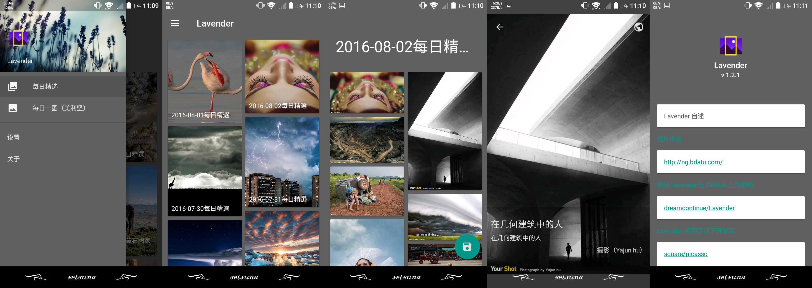

# Lavender
第三方国家地理每日精选Android客户端。

Download
--------
V 1.2.1  
[![Lavender]](app/Lavender.apk)  
[Lavender]:app/src/main/res/mipmap-xxxhdpi/ic_launcher.png "Lavender"

##ScreenShot

Discription:
-----------------
**图片来源**  
http://ng.bdatu.com/  
里面的图片拍摄的都还可以，每天推送十张左右，但是大部分图都有水印，没办法，接口里的图片就那样:broken_heart:。流量党慎用，图片没缩略图，平均分辨率在1000×650左右。

Change log
----------
v1.2.1  
* 布局整改
* 添加美国nat-geo每日一图（真的是只能看这一天的一张图）
* 从1.1.9以下（不包含1.1.9）升级上来的用户请在安装完成后清除下数据再打开
* 缓更中...

v1.2.0  
* 添加缩略图选项
* 从1.1.9以下（不包含1.1.9）升级上来的用户请在安装完成后清除下数据再打开
* Lavender已接近最终版，不再开坑其他功能...

v1.1.9.1  
* 删除切换图标的功能
* 修复AppUpdater未stop的bug
* 单图保存时增加图片分辨率信息
* 从1.1.9以下（不包含1.1.9）升级上来的用户请在安装完成后清除下数据再打开

v1.1.9  
* 采用databinding方式重构项目
* 添加设置及关于界面
* 新增省流模式、检查更新模式
* 添加umeng
* 优化加载逻辑
* 从1.1.9以下（不包含1.1.9）升级上来的用户请在安装完成后清除下数据再打开（realm的配置问题）
                                                                                                                                                                                                                                                                                                                                                                                                                                                                                                                                                                                                                                                   

TODO
----
* 疑难bug修复
* cng api接口获取
* cng 每日一图&文章
* drawer的用户自定义

Thanks
-----------------
感谢国家地理  
感谢默默付出的开源者  
Lavender借鉴了[70kg/Meizi](https://github.com/70kg/Meizi) [oxoooo/earth](https://github.com/oxoooo/earth) 内的部分代码，感谢  
感谢酷友 [@柠冰羽痕Ice](http://www.coolapk.com/u/482620) [@WangMT](http://www.coolapk.com/u/413199)所设计的两个图标

About
-----
* 一个新手练习的小项目
* 采用databinding重构项目
* 尽可能做到MD
* 使用[RxJava](https://github.com/ReactiveX/RxJava)，[RxAndroid](https://github.com/ReactiveX/RxAndroid)，[Retrofit](https://github.com/square/retrofit)，[Gson](https://github.com/google/gson)，[Realm](https://github.com/realm/realm-java)处理网络及本地数据 
* 使用[RxBinding](https://github.com/JakeWharton/RxBinding)优化代码
* DetailActivity到AlbumActivity间的动画切换
* umeng SDK
* 七牛云图片压缩
* ......

Problems
--------
* [PhotoView](https://github.com/chrisbanes/PhotoView) 在动画切换时存在[bug](https://github.com/chrisbanes/PhotoView/issues/243)，未解。故暂时使用[TouchImageView](https://github.com/MikeOrtiz/TouchImageView)
* windowIsTranslucent设置为true后Activity间切换动画无效
* 转屏失效（未找到bug所在），从其他应用切换到Lavender就可以正常转屏
* realm数据不能implements Parcelable...目前解决办法是造一个realm bean一个Parcelable bean,用的时候互相转换...效率超低23333。别问我为什么一定要用Parcelable，喜欢，就是任性:laughing:
* Glide获取加载的图片原始大小，现在用picasso在cancel上有点问题。glide Issues里的某个解决办法在当前版本的Glide上又无效
* 数不清的问题留待解决:sob:

About Me
--------
[![facebook]](https://www.facebook.com/profile.php?id=100008406013865)  
[facebook]:https://www.facebook.com/rsrc.php/yl/r/H3nktOa7ZMg.ico "facebook"
[![twitter]](https://twitter.com/ComtinueD)  
[twitter]:https://abs.twimg.com/favicons/favicon.ico "twitter"
[![wordpress]](http://danyang.party/wordpress/)  
[wordpress]:https://s.w.org/favicon.ico?2 "wordpress"
[![google]](https://plus.google.com/u/0/101425594566289316258/posts)  
[google]:https://ssl.gstatic.com/images/branding/product/1x/google_plus_36dp.png "google+"
[:frog:](http://www.coolapk.com/u/523253)(coolapk图标太大了原谅我不放了)

~~About Lavender~~
-----------------
~~Lavender是薰衣草的意思。  
为什么会起这个名呢，  
因为薰衣草是妳最喜欢的花了。  
薰衣草有个花语  
“等待无望的爱"  
描述我也最合适不过了。  
  
谨以此名，献给终将与我分离的妳。  
即便如此，我永远,永远  
等妳~~  
  
  
:blue_heart::purple_heart::heart:  
:yellow_heart::cloud::heartpulse:  
:sparkling_heart::revolving_hearts::two_hearts:  
:bomb::girl::poop: