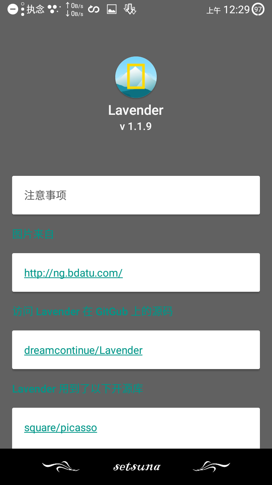

# Lavender
第三方国家地理每日精选Android客户端。

Download
--------
V 1.1.9  
[![Lavender]](app/Lavender.apk)  
[Lavender]:app/src/main/res/mipmap-xxxhdpi/ic_icon.png "Lavender"

##ScreenShot

Discription:
-----------------
**图片来源**  
http://ng.bdatu.com/  
里面的图片拍摄的都还可以，每天推送十张左右，但是大部分图都有水印，没办法，接口里的图片就那样:broken_heart:。流量党慎用，图片没缩略图，平均分辨率在1000×650左右。

Change log
----------
* 采用databinding方式重构项目
* 添加设置及关于界面
* 新增省流模式、检查更新模式
* 添加umeng
* 优化加载逻辑

TODO
----
* 自定义主题颜色（先做这个:weary:）
* 选择图标后launcher刷新几秒才能加载新的，尝试做成立即刷新（貌似Textra做到了可是并没大神公开出来）
* 转屏失效（未找到bug所在）
* 白色背景（手机上状态栏暗色背景设置无效）

Thanks
-----------------
感谢国家地理  
感谢默默付出的开源者  
Lavender借鉴了[70kg/Meizi](https://github.com/70kg/Meizi) [oxoooo/earth](https://github.com/oxoooo/earth) 内的部分代码，感谢
感谢酷友 [@柠冰羽痕Ice](http://www.coolapk.com/u/482620) [@WangMT](http://www.coolapk.com/u/413199)所设计的两个图标

About
-----
* 一个新手练习的小项目
* 采用databinding重构项目
* 尽可能做到MD
* 使用[RxJava](https://github.com/ReactiveX/RxJava)，[RxAndroid](https://github.com/ReactiveX/RxAndroid)，[Retrofit](https://github.com/square/retrofit)，[Gson](https://github.com/google/gson)，[Realm](https://github.com/realm/realm-java)处理网络及本地数据 
* 使用[RxBinding](https://github.com/JakeWharton/RxBinding)优化代码
* DetailActivity到AlbumActivity间的动画切换
* umeng SDK
* ......

Problems
--------
* [PhotoView](https://github.com/chrisbanes/PhotoView) 在动画切换时存在[bug](https://github.com/chrisbanes/PhotoView/issues/243)，未解。故暂时使用[TouchImageView](https://github.com/MikeOrtiz/TouchImageView)
* HomeActivity的reenter动画无效？
* 自动旋转失效，从其他应用切换到Lavender就可以正常转屏
* style内的主题问题，一些特定的地方的颜色 如dialog的title颜色，以及暗色状态栏设置无效（z3c 6.0.1不知道是不是机型问题，其他应用却正常显示）
* realm数据不能implements Parcelable...目前解决办法是造一个realm bean一个Parcelable bean,用的时候互相转换...效率超低23333。别问我为什么一定要用Parcelable，喜欢，就是任性:laughing:
* Glide获取加载的图片原始大小，现在用picasso在cancel上有点问题。glide Issues里的某个解决办法在当前版本的Glide上又无效
* 数不清的问题留待解决:sob:

About Me
--------
[![facebook]](https://www.facebook.com/profile.php?id=100008406013865)  
[facebook]:https://www.facebook.com/rsrc.php/yl/r/H3nktOa7ZMg.ico "facebook"
[![twitter]](https://twitter.com/ComtinueD)  
[twitter]:https://abs.twimg.com/favicons/favicon.ico "twitter"
[![wordpress]](http://danyang.party/wordpress/)  
[wordpress]:https://s.w.org/favicon.ico?2 "wordpress"
[![google]](https://plus.google.com/u/0/101425594566289316258/posts)  
[google]:https://ssl.gstatic.com/images/branding/product/1x/google_plus_36dp.png "google+"
[:frog:](http://www.coolapk.com/u/523253)(coolapk图标太大了原谅我不放了)

~~About Lavender~~
-----------------
~~Lavender是薰衣草的意思。为什么会起这个名呢，因为薰衣草是她最喜欢的花了，而薰衣草有个花语，“等待无望的爱”，描述我也最合适不过了。~~  
  
~~谨以此名，献给终将与我分离的她。即便如此，我依旧等你~~  
  
  
:blue_heart::purple_heart::heart:  
:yellow_heart::cloud::heartpulse:  
:sparkling_heart::revolving_hearts::two_hearts:  
:bomb::girl::poop: