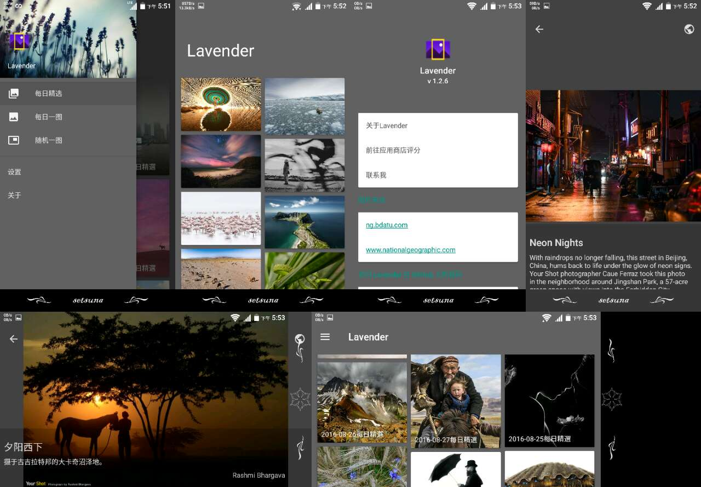

# Lavender
第三方国家地理每日精选Android客户端。

Download
--------
V 1.3.0  
[![Lavender]](app/Lavender.apk)  
[Lavender]:app/src/main/res/mipmap-xxxhdpi/ic_launcher.png "Lavender"

ScreenShot
----------

Discription:
-----------------
**图片来源**  
http://ng.bdatu.com/  
http://www.nationalgeographic.com/  

项目采用DataBinding处理view与activity间的关系，RxBinding处理view事件  
RxJava+Retrofit封装网络请求，Realm缓存网络数据  
采用RxPermission处理6.0及以上的运行时权限获取  
七牛云对超大图片进行镜像存储并返回缩小后的图片  

Change log
----------
**v1.3.0**  
* 修复7.0上dialog按钮颜色的问题
* 高分辨率机型上的图片展示适配

[**older**](changeLog/README.md)

Thanks
-----------------
感谢国家地理  
感谢默默付出的开源者  
感谢[70kg/Meizi](https://github.com/70kg/Meizi) [oxoooo/earth](https://github.com/oxoooo/earth)的开源，Lavender借鉴了部分代码  
感谢酷友 [@柠冰羽痕Ice](http://www.coolapk.com/u/482620)(前任图标) [@WangMT](http://www.coolapk.com/u/413199)(现在的图标) 的帮助

Problems
--------
* ~~[PhotoView](https://github.com/chrisbanes/PhotoView) 在动画切换时存在[bug](https://github.com/chrisbanes/PhotoView/issues/243)，未解。故暂时使用[TouchImageView](https://github.com/MikeOrtiz/TouchImageView)~~(最新版说是已修复，但是我这边使用时依旧存在问题)。
* ~~windowIsTranslucent设置为true后Activity间切换动画无效~~ ([解决方案参考](http://blog.csdn.net/fancylovejava/article/details/39643449)，但是我并没有采用，因为会覆盖ActivityOptionCompat内的动画)
* 因Glide的某些特性，Lavender初次尝试转Glide失败，以后有时间继续尝试Picasso转Glide
* 数不清的问题留待解决:sob:

About Me
--------
[![facebook]](https://www.facebook.com/profile.php?id=100008406013865)  
[facebook]:https://www.facebook.com/rsrc.php/yl/r/H3nktOa7ZMg.ico "facebook"
[![twitter]](https://twitter.com/ComtinueD)  
[twitter]:https://abs.twimg.com/favicons/favicon.ico "twitter"
[![wordpress]](http://danyang.party/wordpress/)  
[wordpress]:https://s.w.org/favicon.ico?2 "wordpress"
[![google]](https://plus.google.com/u/0/101425594566289316258/posts)  
[google]:https://ssl.gstatic.com/images/branding/product/1x/google_plus_36dp.png "google+"
[:frog:](http://www.coolapk.com/u/523253)(coolapk图标太大了原谅我不放了)

~~About Lavender~~
-----------------
~~Lavender是薰衣草的意思  
为什么会起这个名呢  
因为薰衣草是妳最喜欢的花啊  
薰衣草呢，有个花语  
“等待无望的爱"  
描述我是多么的合适啊。  
  
谨以此名，献给终将与我分离的妳。  
即便如此，我永远,永远  
等妳~~  

  
:blue_heart::purple_heart::heart:  
:yellow_heart:[:cloud:](http://danyang.party/wordpress/2016/09/14/235/ "我爱妳，云。如果妳能看到的话，我一直在等妳"):heartpulse:  
:sparkling_heart::revolving_hearts::two_hearts:  
:bomb::girl::poop: